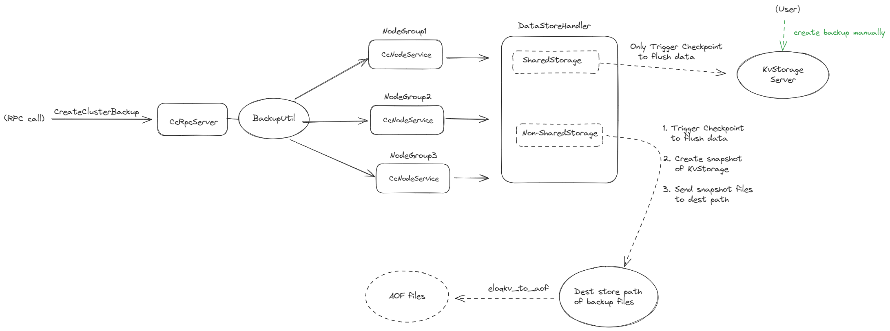

# Backup Design


## Process of Backup

<p align="center">

Figure 1 process of create backup
</p>


## Example of Rpc API to create and check backup task.

1. New backup task
   
- URL:   {Endpoint}/CcRpcService/CreateClusterBackup/

- BODY:
  ```
    {
        "backup_name" : "backup01",
        "dest_host" :"127.0.0.1",
        "dest_user" : "eloq",
        "dest_path" : "/home/eloq/workspace/backup01/"
    }
  ```

- RETURN:
  ```
    {
        "backup_name": "backup01",
        "result": "running",
        "backup_infos": [
            {
                "ng_id": 0,
                "status": "Inited"
            }
        ]
    }

  ```


2. Check status of backup task


- URL:   {Endpoint}/CcRpcService/FetchClusterBackup/

- BODY:
  ```
    {
        "backup_name" : "backup01"
    }
  ```

- RETURN:
  ```
    {
        "backup_name": "backup01",
        "result": "finished",
        "backup_infos": [
            {
                "ng_id": 0,
                "status": "Finished"
            }
        ]
    }

  ```