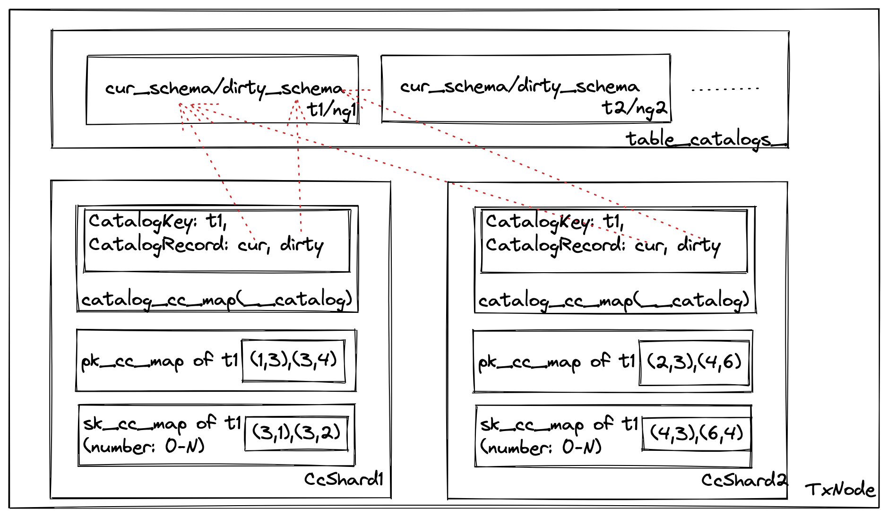
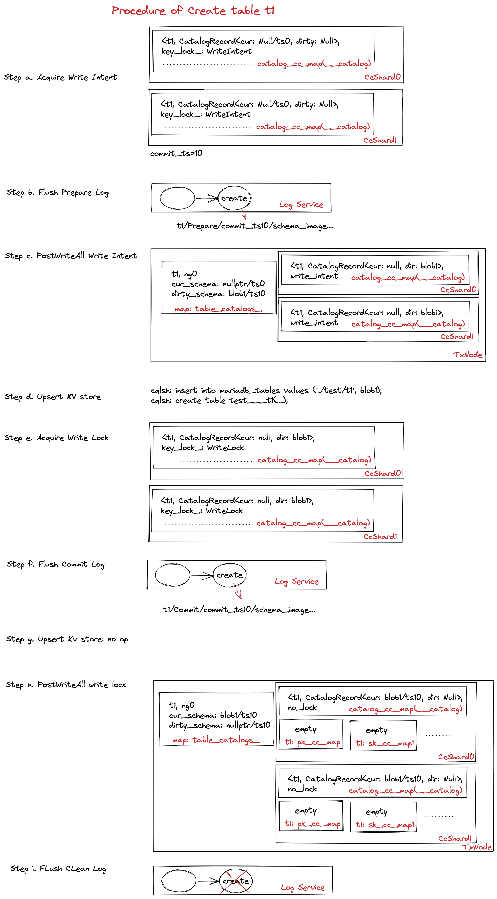

# Catalog Design.

## Where Catalog Stored?

In general, catalog are stored in kv store(e.g. Casssandra) permenantly. Catalog are cached in each tx_service for fast access.

### Catalog in Cassandra

Table catalogs are stored in Cassandra table: `mono.mariadb_tables` with following schema.

```
cqlsh:mono> desc mono.mariadb_tables;

CREATE TABLE mono.mariadb_tables (
    tablename text PRIMARY KEY,
    content blob,
    kvtablename text,
    kvindexname text
) WITH ...
```

`mono.mariadb_tables` stores table name and it's content (frm binary for Mysql).This is a temporary work to store frm binary currently. In future, we may store the `mono.mariadb_tables` with unified information like column name, column type, index keys, foreign keys, constraints etc. We also store kvtablenamne and kvindexname which are table names in cassandra. We map mysql table name to a internal cassandra table name so that alter table statements like rename table can be implemented easier.

Database catalog stores in `mono.mariadb_databases`. It consists of database name and its definition. Definition contains charset, collation etc. To be noted, database is different from normal tables and catalog like func, privilege. Database cannot leverage Mysql pluggable storage interface. Currently we modify the sql_db.cc in Mysql to migrate database catalog from local to a distributed kv store, which is neccessary in a multi-master database.

```
CREATE TABLE mono.mariadb_databases (
    dbname text PRIMARY KEY,
    definition blob
) WITH ...
```

View catalog stores in `mono.mariadb_views`

TODO(xiaoyang): Please update this section.


Other catalogs like use privilege, procedure, sequences etc. are stored as normal eloq tables. They are mostly stored in `mysql` database which inherits from Mysql (to be specific, standard Mysql stores these catalog in `mysql` database with Aria engine).

Currently, these catalogs are stored distributed across the cluster. Mysql will read some catalog tables during startup. As a result,  Mysql startup process depends on the tx_service cluster is ready. Here the ready means all the txnodes finishes the log recovery and can serve transactions. We added a checker in eloq engine initializer to support this behavior.

```
cassandra@cqlsh:mono> describe tables;

i3a65c69d_44d6_4f94_99a7_249edbf859fa  t4e61f112_4628_478f_b633_cecb642c330e
i66356967_5e47_49fd_8ea7_42b3388d9671  t64d26791_4bb8_4381_bc18_53605ef6f5f6
i6b9ace0a_6fc1_4b5f_a55f_44c7c7df6b23  t6845651a_b606_4aff_af9c_c817bb3d722a
i6d73acae_699d_49e7_a120_bddd8e4eb203  t6f944607_86b3_42a1_bbaa_dce1eb52a797
i7769c367_38bf_4967_972f_b83ac830ee52  t7016bbee_d076_40bb_97cf_f5c4ff1b4310
ia6629897_8326_4120_88e4_ec65c9d24eb5  t8f6a1578_5e7b_44f0_9bec_4ca4ca7ea083
id395f7fc_0f73_437d_bac4_f243eb30a385  ta3ac6a37_c2ad_4f8e_9f55_0be786791c2c
ie37baa73_128a_46e5_8296_d7154e89801c  ta47bbfb2_2c1f_42a6_8c0e_5aabff783d26
if6bace16_77cf_48f7_b146_8f9b7be5674f  ta69f8618_3a2c_40bb_bafc_289b2da2827e
mariadb_databases                      taea29e40_d96e_4c6e_9308_b2854ad783dd
mariadb_tables                         taf082854_ea9d_4efb_bc97_1a3ab9bd9833
mvcc_archives                          tb37e82a5_39a1_416c_bc1b_2bda3da26360
t19ae523d_8ef1_4cd6_8332_f7f6fdb53290  tcb2310d5_2288_48fb_be9f_3c7be09cab82
t2b8f202a_6368_46e7_8926_184680b730d5  tccd1c27c_40b5_488f_aac0_8d45b5d7f10e
t2c05248b_35ed_4352_82f8_2c24ee43ddb9  tcf0eb3bb_e956_4e04_92f0_d8f3c1e399e5
t3077e1a4_e295_4bf6_b512_3a5f739506bc  tdf9f81c7_3299_4453_957c_983c119c3cb3
t38d4ee51_7c19_44ac_bb52_26e54b22f153  te0276fd2_e9c7_4efe_b7e7_93a84431af83
t3ffeba19_95c9_42f9_9a4b_5a177d68ea0a  te9cb866f_8cdc_4eb3_9038_baf75915eba3
t4c48d435_dd44_4232_aeba_0c202fbc04be  tf31d5342_7b32_4d41_a9b3_bc21b384140d

cassandra@cqlsh:mono> select tablename, kvtablename from mariadb_tables;

 tablename                         | kvtablename
-----------------------------------+---------------------------------------
                      ./mysql/func | tb37e82a5_39a1_416c_bc1b_2bda3da26360
               ./mysql/global_priv | ta69f8618_3a2c_40bb_bafc_289b2da2827e
               ./mysql/table_stats | tcb2310d5_2288_48fb_be9f_3c7be09cab82
            ./mysql/time_zone_name | ta47bbfb2_2c1f_42a6_8c0e_5aabff783d26
      ./mysql/time_zone_transition | t4e61f112_4628_478f_b633_cecb642c330e
               ./mysql/tables_priv | tcf0eb3bb_e956_4e04_92f0_d8f3c1e399e5
             ./mysql/roles_mapping | taea29e40_d96e_4c6e_9308_b2854ad783dd
                     ./mysql/event | t7016bbee_d076_40bb_97cf_f5c4ff1b4310
             ./mysql/help_relation | t4c48d435_dd44_4232_aeba_0c202fbc04be
                         ./test/t1 | t64d26791_4bb8_4381_bc18_53605ef6f5f6
             ./mysql/help_category | t6f944607_86b3_42a1_bbaa_dce1eb52a797
                ./mysql/help_topic | t3077e1a4_e295_4bf6_b512_3a5f739506bc
                 ./mysql/mono_view | tdf9f81c7_3299_4453_957c_983c119c3cb3
                        ./mysql/db | ta3ac6a37_c2ad_4f8e_9f55_0be786791c2c
                      ./mysql/proc | te0276fd2_e9c7_4efe_b7e7_93a84431af83
 ./mysql/time_zone_transition_type | t3ffeba19_95c9_42f9_9a4b_5a177d68ea0a
              ./mysql/help_keyword | te9cb866f_8cdc_4eb3_9038_baf75915eba3
                 ./mysql/time_zone | taf082854_ea9d_4efb_bc97_1a3ab9bd9833
                  ./sys/sys_config | t19ae523d_8ef1_4cd6_8332_f7f6fdb53290
              ./mysql/proxies_priv | tf31d5342_7b32_4d41_a9b3_bc21b384140d
                ./mysql/procs_priv | tccd1c27c_40b5_488f_aac0_8d45b5d7f10e
     ./mysql/time_zone_leap_second | t6845651a_b606_4aff_af9c_c817bb3d722a
               ./mysql/index_stats | t2b8f202a_6368_46e7_8926_184680b730d5
                 ./mysql/sequences | t38d4ee51_7c19_44ac_bb52_26e54b22f153
              ./mysql/columns_priv | t2c05248b_35ed_4352_82f8_2c24ee43ddb9
              ./mysql/column_stats | t8f6a1578_5e7b_44f0_9bec_4ca4ca7ea083

(26 rows)
......
```


### Catalog in DynamoDB
TBD

### Catalog in Memory
Access KV store is slow, eloqDB stores the catalog in memory as well. Catalogs like privilege are normal eloq tables, which are stored in ccmap directly. This section focus on how does eloqDB store table catalog in tx_service layer.

<p align="center">

Figure 1 Catalog In Memory
</p>

Table catalog are physically stored in LocalCcShard for each txnode (named table_catalogs_). They are organized as nested map: TableName->NodeGroup->CatalogEntry.

```
//local_cc_shard.h
std::unordered_map<TableName, std::unordered_map<NodeGroupId, CatalogEntry>> table_catalogs_;
```

// TODO @zhangh43 please update doc about catalog entry.
The CatalogEntry stores the actual current schema and dirty schema using shared_ptr. Shared_ptr means the schema pointers are owned by CatalogEntry and CatalogRecord together. When leader becomes follower, we will erase CatalogEntry, but the schema pointers should not be freed, since there is a chance the Mysql thread is accessing it concurrently. The TableSchema is created by MariaCatalogFactory `CreateTableSchema()`. It will take catalog_image as input and call `init_from_binary_frm_no_thd()` to parse the image into mysql::TABLE_SHARE. 

```
struct CatalogEntry
{
  std::shared_ptr<TableSchema> schema_{nullptr};
  std::shared_ptr<TableSchema> dirty_schema_{nullptr};
  uint64_t schema_version_{0};
  uint64_t dirty_schema_version_{0};
}
```

CatalogEntry is at node level, and we have CatalogRecord at ccshard level. In each ccshard, there is a special ccmap called catalog_cc_map. Its key is `__catalog` and the content of ccmap are kvpairs where key is table name and value is CatalogRecord. CatalogRecord is similar to CatalogEntry. The main difference is that CatalogRecord contains some extra information, schema_image_ and dirty_schema_image_ stores the current schema image and new schema image passed from mysql during a upsert event.

```
struct CatalogRecord
{
    const TableSchema *schema_{nullptr};
    const TableSchema *dirty_schema_{nullptr};
    uint64_t schema_ts_{0};
    std::string schema_image_{""};
    std::string dirty_schema_image_{""};
}
```


#### Fetch Table Catalog
Suppose a table is created by previous transaction and server restart. Then how does table catalog being fetched from KV store? There are two ways in eloqdb:

1. Using eloq_discover_table() interface in ha_eloq. When this is the first open_table on the target table t1. Handler interface `eloq_discover_table()` will be called. It will issue a local ReadTxRequest to Tx_service to get the table catalog. Local ReadTxRequest will read a special ccmap `__catalog` using ReadCcRequest. Generally this ccmap is similar to normal TemplateCcMap, but has some additional logics which are impemented in catalog_cc_map.h. The logics include: For ReadType::Inside, if the catalog_ccmap doesn't contain the value, check whether the CatalogEntry is constructed at this node. If so create pk/sk ccmap and install the value into catalog_ccmap on the fly. For ReadType::Outside, create CatalogEntry and pk/sk ccmaps on the fly.

2. Fetch catalog from kv store on the fly. When executing a CcRequest on a ccmap, the ccmap may not be created yet. If LocalCcShard contains the catalog, then we are able to create the ccmap based on catalog. But if the catalog doesn't exist, then we need to generate FetchCatalogCc request to fetch catalog from kv store on the fly. The current CcRequest will be queued in FetchCatalogCc request. And once the catalog in kv store is returned and FetchCatalogCc finished, then the queued CcRequest will be executed again.

#### Create/Drop Table Catalog
Create/Drop Table statement in Mysql will create/drop the table catalog. We focus on both normal DDL and replay DDL as follows:

1. Normal create/drop table DDL.

Create/Drop table in eloqDB is implemented as a multi-phase operations:

a. acquire all the write intents: This is used to prevent concurrent DDL on the same table.

b. flush prepare log: when prepare log is flushed, the DDL must be succeed no matter node crash or network errors. See Replay DDL section for details.

c. postprocess all the write intents: it doesn't release the write intent, but create the dirty version of the schema. To be more detail, PostWriteAllCc request with PostWriteType::PrepareCommit is used to handle this stage. For shard0, it will call `CreateDirtyCatalog` to generate the dirty schema on LocalCcShard. The catalogRecord on each ccshard will be uploaded as well with the new dirty schema. From now on, concurrent DML on this table can see both current and dirty schema. This takes no effect on create/drop table, but it is crucial for creating index. The new insert/delete tuples will modify index tables for current and dirty schema at the same time.

d. upsert kv store (could be long running time): create table/alter table/create index on the kv store.

e. acquire all the write locks: this blocks all the DML on the table, but lock holding time is short.

f. flush commit log: record the kv store operation is finished in the log. If failover happens, we can start from this point.

g. upsert kv store (some kv delete op should happens after write lock is held): drop table on the kv store.

h. postprocess all the write locks: commit the dirty schema and release the write locks. Then later DML on the table can see the new schema. To be more detail, PostWriteAllCc request with PostWriteType::PostCommit is used to handle this stage. For drop table request, corresponding pkccmap and skccmap of the table will be dropped on every ccshard. And `CommitDirtyCatalog` will be called for the last ccshard to make dirty schema as current schema on LocalCcShard. 

i. flush clean log to truncate ddl record in log service.

<p align="center">

Figure 2 Create Table Steps
</p>

2. Replay DDL.

Case a. No failure during DDL. There are three logs which are flushed to log service: PrepareLog, CommitLog and CleanLog. The last CleanLog will clean the log service for this DDL. You can treat DDL do checkpoint inside the transaction and hence the redo log can be truncated when transaction finished.

Case b. Failure before Prepare log is flushed. This case will abort the current DDL.

Case c. Failure after Prepare log is flushed and before Commit log is flushed. Then the failover node will call `CreateDirtyCatalog()` to finish step c and call `AcquireWriteLock()` to finish step e. If the node is the original txCoordinator, it will call `CreateSchemaRecoveryTx()` to restart DDL operation(UpsertTableOp) from step c. Note that the `CreateSchemaRecoveryTx()` may `CreateDirtyCatalog()`, upsert kv store and `AcquireWriteLock()` again which requires these steps to be idempotent.

case d. Failure after commit log is flushed and before clean log is flushed. The failover node will call 	`CreateCatalog()` to create CatalogEntry in localCcshard and create pkccmap and skccmap respectively. It will also try to add itself into catalog_cc_map to finish step h. If it's txCoordinator, it will call `CreateSchemaRecoveryTx()` to restart DDL operation(UpsertTableOp) from step g.


Q&A Why do we have CatalogEntry on LocalCcShard and CatalogRecord on each CcShard?

This is due to access KV store is slower. By using CatalogEntry at LocalCcShard level, we can have only one access of KV store for each table on each node.

### Catalog Invalidation
TBD
