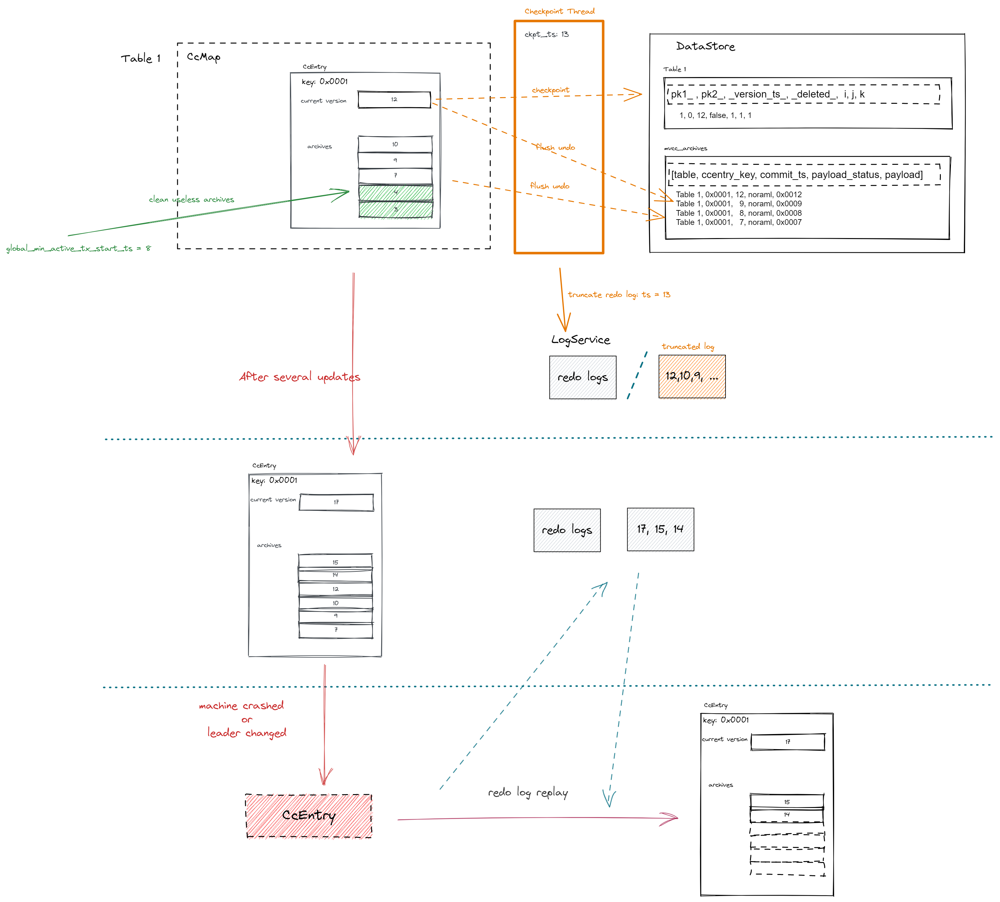

# MVCC Design.

MVCC, Multi-Version Concurrency Control. Common means to deal with read-write conflicts in the implementation of modern database engines (including mysql, Oracle, PostgreSQL, etc.)

Mvcc is a compromise of row level locking. It avoids using locks in many cases and provides less overhead. Depending on the implementation, it allows non blocking reads and locks only the necessary records while the write operation is in progress.

Mvcc will save data snapshots at a certain point in time. This means that transactions can see a consistent view of the data, no matter how long they need to run. This also means that different transactions may see different data in the same table at the same time point.

## Two Different implementations of MVCC in other databases.
- The first way is to save all historical versions of data records in the database.
When these historical versions of data are no longer needed, the garbage collector removes these records. This method is adopted by PostgreSQL and Firebird/Interbase. SQL server uses a similar mechanism. The difference is that the historical versions is not saved in the database, but in another database(Named tempdb, different from the main database).

- The second implementation method only saves the latest version of data in the database, but will dynamically reconstruct the old version of data when using undo log. This method is used in Oracle database and Mysql/Innodb.

# Design of MVCC in EloqDB
EloqDB use the first way above to implement MVCC feature. 


<p align="center">

Figure 1 Overview of Mvcc Design
</p>

Next, this article will describe: the design of historical version storage, Read/Scan using MVCC, how to clean useless historical versions safely, how to assure needed historical version is not lost even if machine crashed, how to ensure the snapshot read is repeatable without read lock.

## How to store the historical versions
### Changes of CcEntry
Before, struct of `CcEntry` is as follow :
```
{
    const KeyT *key_;
    ValueT payload_;
    RecordStatus payload_status_;
    uint64_t commit_ts_;
}
```
`payload_` stores the latest version data of one record;
`payload_status_` identifies this record is `Normal` or `Deleted`;
`commit_ts_` is the commit timestamp of the last one of transactions updating this record;


To support mvcc feature, add a list container (`archives_`) to store the historical versions in  `CcEntry`. And, to reduce the memory copie times and usage, changed the datatype of `payload_` to `shared_ptr<ValueT>`

```
{
    const KeyT *key_;
    std::unique_ptr<ValueT> payload_;
    RecordStatus payload_status_;
    uint64_t commit_ts_;

    std::deque<VersionRecord<ValueT>> archives_;
    // Data in archives_ are arranged in descending order of commit timestamp.
}

struct VersionRecord
{
    std::unique_ptr<ValueT> payload_;
    uint64_t commit_ts_;
    RecordStatus payload_status_;
}
```
When the newest data is committed, the current data in CcEntry is changed to historical version. So, before updating the record, should call `CcEntry::ArchiveBeforeUpdate()` to copy the current version data of record (payload_, commit_ts_, payload_status_) into `archives_`. 

### Changes of kvstore
Add a new table named `mvcc_archives` to store historical version data when ccentry is kicked out from `CcMap` but historical versions is needed.
```
table struct:
  { table_name text,
    key blob,
    commit_ts bigint,
    payload_status int,
    payload blob,
    PRIMARY KEY (table_name, key, commit_ts))
    WITH CLUSTERING ORDER BY (key ASC, commit_ts DESC)
  }
```
For data in `mvcc_archives` table is orgnized as KV pair. This means fetching historical must need encoded key, that is, it is unable to handle sql query (like 'select * from t1 where i=1') from mysql query directly. If the row is deleted from mysql table and base table in KvStore is updated after checkpointing, once the `CcEntry` of the row is kicked out from memory, then, historical versions will be unvisible, some long running transaction will abort if it needs a consistent read.

So, to avoid the above case, base table in KvStore uses fake deletion.
Specifically, add a column named `__deleted__` on the base table. The default value of `__deleted__` column is `false`. If one row is deleted from mysql table, the value of `__deleted__` column will be set as `true`. And, it will be really removed from base table after 24 hours.(Implemented through adding `USING TTL 86400` caluse on update cql query. )

For an example, one base tables in KvStore may be defined as follows now:
```
 (
    pk1_ int,
    pk2_ smallint,
    "___deleted___" boolean,
    "___version___" bigint,
    key text,
    col-1 text,
    col-2 bigint,
    col-3 text,
    PRIMARY KEY ((pk1_, pk2_), key)
)
```


## MVCC READ (Consistent read without read lock)

*(NOTICE: Before reading this part, please visit "README.md" document to fetch the procedure of read.
This part is a sketch of the read procedure under `SI` isolation level. Please visit  `ha_eloq::PkRead()`,`TemplateCcMap::Execute(ReadCc &req)`, `CcEntry::MvccGet()` functions to acquire the details.)*

Before going into detail, let's understand which version is ** the wanted version ** of MvccRead: the version whose `commit_ts` is equal with `read_ts` or the version whose `commit_ts` is the closest to `read_ts` (of course, the `commit_ts` must less than `read_ts`).

**Case all historical versions is stored in memory,** only read `CcMap`/`CcEntry` can get the wanted version data: 

- (1) If the given read timestamp is bigger than or equal the `commit_ts` of current version. Then, return the current version data.
- (2) Otherwise, scan the `archives_` to fetch the version whose `commit_ts` is closest to the read timestamp.

*(this procedure is implemented in `CcEntry::MvccGet()`.)*

**Case not all historical versions is stored in memory,** that means needed version maybe in KvStore.
Main process is as follows, the first two step is same as above:

- (1) If the given read timestamp is bigger than or equal the `commit_ts` of current version. Then, return the current version data.

- (2) Otherwise, scan the `archives_` to fetch the version whose `commit_ts` is closest to the read timestamp.

- (3) After scanning `archives_`, not found the needed version, then return "VersionUnkonwn" record status. That means should fetch the needed version from KvStore table `mvcc_archives`.

- (4) Search the KvStore table `mvcc_archives` to fetch needed version. In short, excute one sql query as follows to fetch needed version. Maybe no version data will be found in `mvcc_archives` table.
```
"SELECT table_name, key, commit_ts, payload_status, payload FROM {table_name}  WHERE table_name=? AND key=? AND commit_ts<=? LIMIT 1"
```

**Case the key is not stored in memory** (Of course, the historical version cannot be in memory too),
Main process is as follows:

- (1) For the key is not in memory, `Unkonwn` status is returned from `TxService` while searching `CcMap`. Then, searching key from KvStore is needed.

- (2) If the version of record selected from base table in KvStore is just the wanted version, that is, its `commit_ts` is less than or equal with `read_ts`, it is over. 

- (3) Otherwise, searching `mvcc_archive` table is needed. Just execute the cql query as follows to fetch the wanted version. (This step is same with the 4th step in above case.)
```
"SELECT table_name, key, commit_ts, payload_status, payload FROM {table_name}  WHERE table_name=? AND key=? AND commit_ts<=? LIMIT 1"
```

## MVCC SCAN 

The procedure of fetching needed historical version  is similar to it in "MvccRead".

As konwn, the scan operation in EloqDB is a merge of entries in ccmap, local write set and data store. 

Here, the detailed procedure for searching key with query conditions is skipped.

- (1) Traverse `CcEntry` list and base table in KvStore to get the keys meeting query condition.

- (2) For each key in scan result, charge the `commit_ts` of current scan result is equal to or less than `read_ts`. If not, must fetch the wanted version from `mvcc_archives` table.
(this step is similiar to "MvccRead").

*(NOTICE: Please visit `ha_eloq::PkIndexScanNext()`,`TemplateCcMap::Execute(ScanOpenBatchCc &req)`，`TemplateCcMap::Execute(ScanNextBatchCc &req)`,`TemplateCcMap::ScanKey()` for detailed implementation.)*


## How to safely clean historical versions

**1- How to detemine one histoical version is useless?**

*(TERM: Here, `global_min_tx_start_ts` means the oldest start timestamp of current active transactions under `SI` isolation level.)*

Eg. There is one record that has serveral versions, current version's `commit_ts` is 12, historical versions' `commit_ts` is [10,9,7,4,3].

- Case `global_min_tx_start_ts` bigger than or equal to "12"(current version's `commit_ts`), that is, current version is the wanted version. Historical versions will never been used. So, all historical versions can be removed.
```
 [10,9,7,4,3] can be removed.
```

- Case `global_min_tx_start_ts` is "9", that is, the historical version whose `commit_ts` is "9" is wanted version. So, these historical versions whose `commit_ts` less than "9" can be removed.

```
 [7,4,3] can be removed.
```

- Case `global_min_tx_start_ts` is "8", that is, the historical version whose `commit_ts` is "7" (less than 8) is wanted version. So, these historical versions whose `commit_ts` less than "7" can be removed. 

```
 [4,3] can be removed.
```

- Case `global_min_tx_start_ts` is "2" (less than 3), that is, none of the historical versions can be removed.

```
 [] can be removed.
```

**2- When are useless historical versions removed ?**
Up to now, there are two places to remove them. 
(1) before updating current version;
(2) when freed memory is insufficient;

## How to promise the "MvccRead" is repeatable while another transaction may be updating the same CcEntry 

### Under what circumstances can unrepeatable reading occur using snapshot read?
Case read-tx's `read_ts` is bigger than the current `commit_ts` of ccentry(*that is, the version to read is the current version*). And, the ccentry is updated with the `commit_ts` smaller than `read_ts`. Then, next snapshot read of the read-tx will get the newly uploaded version.

### Review the "RepeatableRead" design of "OCC" and "Locking" CcProtocol in EloqDB

*(Read record of readset including: `CcEntryAddr`, `version_ts`, `CcProtocol`, `LockType`)*

- LOCKING: Add `ReadLock` to block other tx updating the same `CcEntry`.

- OCC: Read operation does only add `ReadIntent`(can not block updating), but all read records are put into readset. So, there is a "Vali()" stage to validate whether the read record has been updated through comparing the `version_ts` in readset and `commit_ts` of `CcEntry`.

- MVCC: MvccRead uses `NoLock` lock type for normal read. And, the read records are not put into readset. (For, readset used for catching lock info for `postread` to release locks added while reading.)

### Explain how "MvccRead" ensure the repeatability of reading

Let's use "mvcc-read_Tx" term represent the transaction doing "MvccRead", use "write_Tx" represent another transaction that may be updating the same ccentry.

Before snapshot read, there are two cases:

- (1) "write_Tx" is on stages **before `AcquireWrite()` stage**:

As we konwn, the  `commit_ts` of "write_Tx" has not been calculated on these stages. And, its `commit_ts` must be bigger than `last_read_ts` (also called `last_vali_ts` before) of the `CcEntry`.

 the `commit_ts` calculation is as follows:
 ```
 commit_ts = max {Tx's start_ts, max{read entries's commit_ts}, max{write enties's last_vali_ts_ + 1},max{write enties's commit_ts_ + 1}, ccs.ts_base_, tx.lower_bound_}
 ```
 So, "mvcc-read_Tx" just update the `last_read_ts` of the `CcEntry` can guarantee the read is repeatable.

- (2) "write_Tx" is on stages **after `AcquireWrite()` stage**:

On these stages after `AcquireWrite()`, inputs of `commit_ts` calculation has collected by "write_Tx". Then, `commit_ts` of "write_Tx" can not be interfered.

To ensure repeatable read, EloqDB add `wlock_ts` into `CcEntry`. Once the ccentry is locked by "write_tx", `wlock_ts` must be updated.
```
 wlock_ts = std::max(req.Ts(), shard_->Now());
 req.Ts() is the `ts_base` value of the node creating "write_tx".
```

At this time, "mvcc-read_Tx" reads the ccentry, if the ccentry has been locked by "write_tx" and `wlock_ts` < `read_ts`, this "mvcc-read_Tx" must abort or retry until the write lock released. 


## How to promise the historical versions not lost even if machine crashed

Now, historical versions is flushed while checkpointing. Then, redo log is truncated.

So, historical version unflushed can be restored along with replaying redo log.

For flushing to base table and flushing archives table is different function now, what if flushing to base table succeeds, but flushing to the undo log fails? It is safe to update the local checkpoint timestamp, but not safe to truncate the redo log. We need to consider this case.

