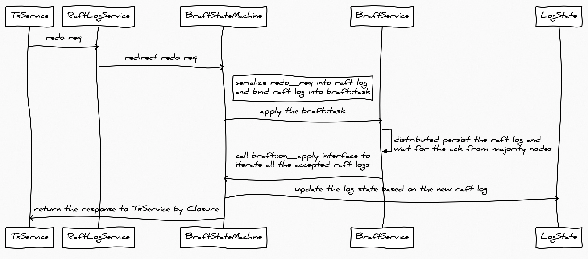
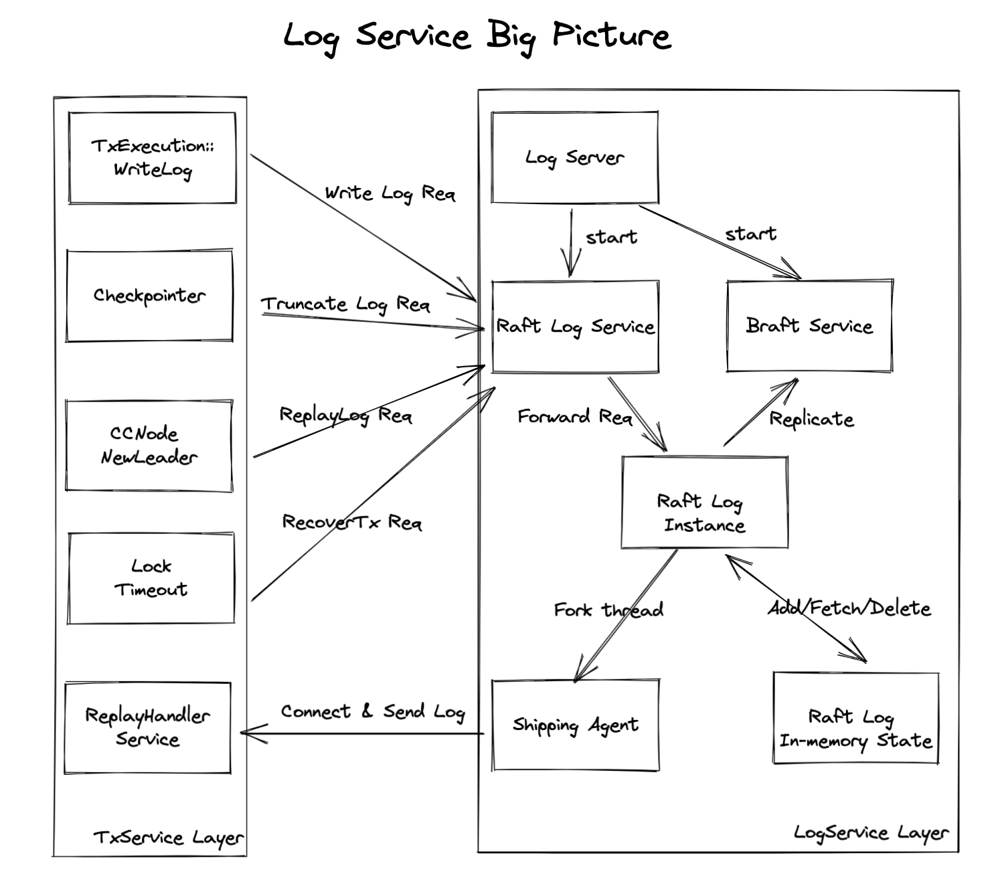

# Log Service
Transaction Log Service for EloqDB.

# Overview

Transaction Log Service is used to manage redo log and handle recovery for EloqDB. To ensure durability and failover, database system often uses redo log to write the database change into append-only files. EloqDB follows this pattern, but has some characteristics:
1. use raft state machine to implement log file HA instead of replication protocol used by MariaDB and PostgreSQL. Refer to [Braft](#Cornerstone:-Braft) for details.
2. all the log record are in format of key-value pairs instead of pages in btree-based disk database.
3. distributed log service and can scale independently with transaction service layer.
4. fast distributed log commit algorithm which reduce the execution time of tranasction critical path. Refer to [KeyNotes](#KeyNotes) for details.

Log Service is designed as a distributed architecture, which could contains hundreds of nodes and organized by Log Groups. Each Log Group contains several Log Nodes and supplies high avaliability and durability based on Raft consensus algorithm. Log Group can be treated as the sharding of the redo log with the sharding key as the CCNode Group id. To be specific, each CCNode Group is attached to a Log Group when write logs and all the redo log of this CCNode Group will redirect to this Log Group. This decouple design enable log service can scale independently.

The key design idea of Log Service is that fault is often, especially on cloud, but fault down time is much shorter than available time. Hence, we value the performance of available time againt the recover time when fault happens. Based on the above idea, several techniques are applied to EloqDB, such as one-phase commit, all-groups replay. Details refers to [KeyNotes](#KeyNotes).

# Concept
**CC Node**: tx_service layer concept. CC Node is a transaction node, which stores ccmap(buffer pool), sharding function, lock table etc. It is responsible for receiving tx request from frontend runtime, processing the request with transaction guarantee, and redirecting to storage engine like Cassandra if cache miss happens.

**CC Node Group**: raft group of CC Node. Every CC Node Group has one leader and several followers. Leader CC Node is responsible for handling the actual read/write request and followers are used to support high availability (read replica may support in future). Currently the ccmap content will not be written into CC Node Group raft state machine to save the memory resources.

**Log Node**: Log Node stores the log state. It is responsible for receiving the log requests, such as write log, truncate log and update term etc. After receiving requests, Log Node will apply the requests into raft state machine to achive the durability and append the log items into a in-memory log state structure. Then client is able to read and search the redo log effciently to finish the recovery related processes quickly.

**Log Group**: raft group of Log Node. Different from CC Node Group, Log Group will write all the redo log records into the raft state machine to achieve durability and HA.

# Cornerstone: Braft
We will not cover the principle of raft consensus algorithm, please refer to https://raft.github.io/ for articles and videos.

Braft is an open source raft implementation by Baidu. In this section, we focus on explaining the braft interface and how does EloqDB uses braft as the cornerstone of log service.

Note that different raft interface are universal and with minor differences, hence EloqDB is not bind to braft actually.

EloqDB interacts with braft by the following steps (picture below is a help to understand):
1. the redo log service, which receives requests from tx_service (call it as redo_request) and redirect the requests into the braft state machine (RaftLogInstance).
2. the braft state machine receives the redo_request and then serialize it into the raft log (could be a write redo log, truncate redo log, update term etc.), then bind to a braft::task and finnaly apply this task to braft rpc service.
3. the braft rpc service distributedly persists the raft log in all the nodes and notify state machine after receiving the ack from majority nodes.
4. the braft state machine call the braft::on_apply interface to iteratate all the raft logs and update the log state. Here the log state is the list of redo logs, term and replay status of each ccnodes. For example, write log request will append a new entry in redo log list, replay log request will update the ccnode term and replay status in log state. It's important to understand that the state of raft machine in EloqDB is not a single value, but a state class which contains both scalar values and array values.
5. finnally, the braft state machine returns response to tx_service using closure interface. Google rpc closure for details.

# Interface Between TxService and Log Service

Log Service has the following APIs:
1. Log append. Log service stores redo log through WriteLogRequest into state machine and update a Log State
2. Log replay. Log service will be notified with a UpdateNodeTermRequest when raft select a new CC Node leader and store the new term into state machine.
3. Log truncate. Log service truncate redo log through TruncateLogRequest into state machine and delete the item from Log State.
4. Recovery transaction. Genrally, transaction execution follow the workflow of lock->write_log->commit/abort->postcommit->unlock. When CC Node failover happens, the lock stored on other CC Nodes, but acquired by the failed CC Node, has no chance to unlock. Moreover, other CC Nodes don't even know the transaction is committed or not. To recovery these leaked lock, Tx Service layer will send RecoverTxRequest to Log Service to get the transaction's status and node term information.

Below picture shows the communication between tx_service and log service in a big picture.
Several modules/functions of tx_service needs to communicate with log service:
1. when transaction commits, it needs to write redo log.
2. when checkpointer flushes data, it is able to truncate log.
3. when ccnode failovers and raft service selects a new leader, it needs to replay log to finish recovery.
4. when ccnode failover, transactions are killed without release the lock, which cause remote lock timeout. Given the case that some of killed transaction are committed while others are not committed. It needs to check with log service with RecoveryTx request. If committed, recovery should also be done with replay log.
5. Case 3 and Case 4 both need replay log. ReplayHandler service at tx_service side will listen and waiting log shipping agent at log service side to connect and send redo log to it.

Module of log service:
1. **log server** is responsible for starting raft log service and braft service using brpc.
2. **raft log service** is a brpc service waiting request from tx_service side.
3. **braft service** manages replication and HA.
4. **raft log instance** implements braft state machine interface, which apply the messages from raft log service and redirect them to braft service to persist and HA. When apply succeeds, the callback(on_apply) will handle the request logic, e.g. write/truncate log record and update ccnode term into log state or setup a log replay shipping agent.
5. **log in-memory state** stores the state of raft state machine which includes redo log list and term and replay status of ccnode.
6. **log shipping agent** is a thread which sends redo logs to tx_service when recovery is needed.

# KeyNotes
1. One phase commit. When write redo log, CC Node Group will be attached to a specific Log Group. The CC Node Group is responsible for generating the redo log based on the working set, and flush all the changed tuples into this Log Group. Since there is only one Log Group involved, one phase commit is sufficient to ensure the correctness. Compared with traditional two phases commit, One phase commit save additional fync and rpc round, hence is faster. 
2. All groups replay. One problem of one phase commit is that all the tuples of a single transaction is written into one Log Group, but tuples are sharded across the ccnode cluster. This leads to the replay process of a failover CC Node has to get the replay redo log from all the Log Groups. This slows down the recovery process. But it's not a big regression, since the log replay can be done in parallel among different Log Groups with asychrous API. As a result, the side effect is controllable.

# Q&A
1. Why does Log State store the CC Node Group's leader information?
   First of all, 1. Each CC Node knows whether it is the leader or the follower. 2. CC Node Group's leader is stored in the cache of Sharder. If cache is out-of-date, the request may redirect to a follower which causes the transaction execution failed on this follower node. Caller will try to UpdateLeader() by means of ccnode's raft interface. BTW, Retry logic can be investigated in future to avoid abort the transaction.

   But what's the matter to Log State? Recall that the Log service API includes ReplayLogRequest which updates the ccnode term. When a new CC Node becomes the leader, it will send this request to its corresponding Log Service. It's also a log request and will be applied into log raft state machine. As a result, we also store leader information in log state.

   So the question becomes why do we need to make Log Service to be aware of the CC Node Group leader information? The answer is CC Node failover. We discussed the CC Node failover algorithm in README.md of tx_service repo in detail. 

